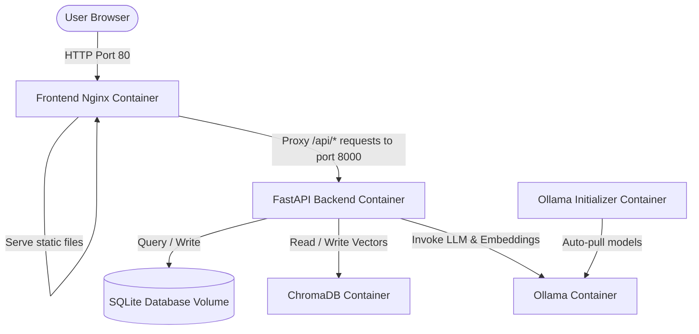

# YOWON AI — Production Docker Deployment Guide

This document describes the enterprise-grade Docker container architecture, network topology, storage design, and operational procedures for deploying YOWON AI in production environments (Linux VMs, cloud instances, or local server setups).

---

## 1. Container & Deployment Architecture

YOWON AI is partitioned into four primary containers that communicate securely via an isolated Docker bridge network.



### Container Registry

| Container Name | Base Image | Role / Responsibility | Internal Port |
| :--- | :--- | :--- | :--- |
| `yowon-frontend` | `nginx:alpine` | Serves React+Vite SPA, runs reverse proxy, enforces rate limits, handles gzip compression | `80` (Exposed to host) |
| `yowon-backend` | `python:3.11-slim` | Executes FastAPI server, schedules Crews/agents, runs Repository Intelligence engines | `8000` (Internal bridge) |
| `yowon-chromadb` | `chromadb/chroma:latest` | Hosts persistent vector embeddings store | `8000` (Internal bridge) |
| `yowon-ollama` | `ollama/ollama:latest` | Runs LLM model execution server | `11434` (Internal bridge) |
| `yowon-ollama-init` | `curlimages/curl` | Ephemeral setup script that auto-downloads LLM model dependencies on initial start | *N/A (Exits when done)* |

---

## 2. Storage & Volume Layout

To ensure absolute zero data loss during updates and container restarts, all database files, uploaded codebases, generated reports, and LLM model files are stored in Docker persistent volumes.

```
/ (Docker Named Volumes)
├── yowon_database             # Mounted to /app/database (holds yowon.db)
├── yowon_uploads              # Mounted to /app/uploads (user uploaded zips)
├── yowon_reports              # Mounted to /app/reports (generated report JSONs/PDFs)
├── yowon_repository_cache     # Mounted to /app/repository_cache (and /app/repository_cache/analysis_cache)
├── yowon_chroma_data          # Mounted to /chroma/data (vector storage persistence)
└── yowon_ollama_data          # Mounted to /root/.ollama (downloaded LLM model weights)
```

---

## 3. Network Topology

All containers are bound to a private, isolated bridge network named `yowon_network`.
- Direct access to `yowon-backend`, `yowon-chromadb`, and `yowon-ollama` is completely blocked from outside the server.
- The only entrypoint from the public internet is the `yowon-frontend` container on port `80`.

---

## 4. Quickstart Command Reference

### Linux & macOS
```bash
# Start YOWON AI
./docker-start.sh

# Stop YOWON AI
./docker-stop.sh

# Update codebase and rebuild containers
./docker-update.sh

# Backup database and uploads
./docker-backup.sh

# Restore data from archive
./docker-restore.sh backups/yowon_backup_YYYYMMDD_HHMMSS.tar.gz

# Clear all containers, caches, and volumes
./docker-clean.sh
```

### Windows (PowerShell)
```powershell
# Start YOWON AI
.\docker-start.ps1

# Stop YOWON AI
.\docker-stop.ps1

# Backup data
.\docker-backup.ps1

# Restore data
.\docker-restore.ps1 -BackupFile backups\yowon_backup_YYYYMMDD_HHMMSS.tar.gz
```

---

## 5. Health Monitoring & Verification

You can monitor the cluster state directly using the enriched backend health endpoint:

```bash
# Verify Backend Health & System Stats
curl http://localhost/api/health
```

### Expected JSON Response Structure
```json
{
  "status": "ok",
  "service": "YOWON AI",
  "version": "2.3.0",
  "database": {
    "status": "healthy",
    "error": null
  },
  "ollama": {
    "status": "healthy",
    "models": ["qwen2.5:7b", "nomic-embed-text"],
    "errors": []
  },
  "chromadb": {
    "status": "healthy",
    "error": null
  },
  "repository_intelligence": {
    "status": "healthy"
  },
  "disk_usage": {
    "total_gb": 40.0,
    "used_gb": 15.2,
    "free_gb": 24.8,
    "percent_used": 38.0
  },
  "memory_usage": {
    "total_mb": 8192.0,
    "used_mb": 4096.0,
    "free_mb": 4096.0,
    "percent_used": 50.0
  }
}
```

---

## 6. Troubleshooting Guide

### Q1: Ollama container fails to start or pulls models slowly
- **Cause**: Network connection issues during model download or lack of system memory.
- **Solution**: Check Ollama logs using `docker compose logs -f ollama`. If the container is killed, check if the host server has at least 8GB RAM.

### Q2: Rate limiting errors (HTTP 429) appearing in browser console
- **Cause**: The Nginx reverse proxy enforces a limit of 10 requests per second with a burst rate of 20 to protect the API from scraping or abuse.
- **Solution**: If you need to increase this limit for internal tooling, edit `frontend/nginx.conf` and adjust `rate=10r/s` to a higher value, then run `./docker-update.sh`.

### Q3: Database lock or "Database table not found" errors
- **Cause**: Direct write collision or missing database migration steps.
- **Solution**: The backend automatically runs `init_db()` and programmatic migrations on startup. If SQLite tables are corrupted, stop the container, run `./docker-backup.sh` to save files, and recreate the container.
