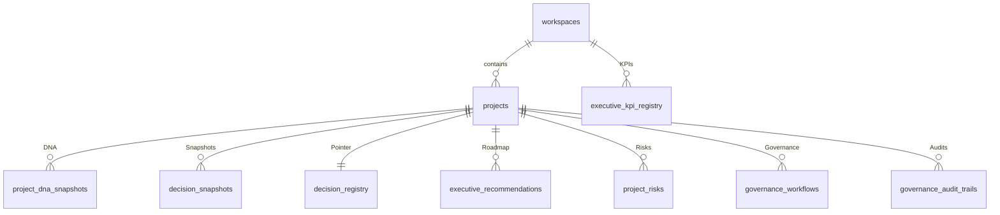

# YOWON AI — Database Schema Freeze Specification (v1.0)

This document registers every database table in the V1.0 Enterprise Core and defines immutability levels.

---

## 1. Entity Classification Matrix

| Table Name | Classification | Primary Key | Foreign Keys | Soft Delete | Snapshot Strategy |
| :--- | :--- | :--- | :--- | :--- | :--- |
| `users` | **CORE** | `uuid` | None | Yes | None |
| `workspaces` | **CORE** | `workspace_id` | None | No | None |
| `projects` | **CORE** | `id` | `workspace_id` | Yes | None |
| `project_dna_snapshots` | **CORE** | `uuid` | `project_id` | No | Full DNA Feature list |
| `decision_registry` | **CORE** | `uuid` | `project_id` | No | Registry cursor |
| `decision_snapshots` | **CORE** | `uuid` | `project_id` | No | Immutable Snapshot |
| `executive_recommendations` | **CORE** | `uuid` | `project_id` | No | Version history |
| `project_risks` | **CORE** | `uuid` | `project_id` | No | None |
| `governance_workflows` | **CORE** | `uuid` | `project_id` | No | Step status logs |
| `governance_audit_trails` | **CORE** | `uuid` | `project_id` | No | Immutable trace ledger |
| `project_simulations` | **EXTENSION** | `uuid` | `project_id` | No | Simulation inputs |
| `executive_kpi_registry` | **EXTENSION** | `uuid` | `workspace_id` | No | Aggregate records |

---

## 2. Entity Relationship Diagram

---

## 3. Database Rules & Compatibility Policy
- **Schema Modifications**: Altering columns or dropping indexes from **CORE** tables is strictly forbidden.
- **Extensions**: Subsystems requiring additional parameters must append new table entities and link them to **CORE** tables using Foreign Keys.
- **Migrations**: Autocommit migrations must run in non-destructive append-only modes.
