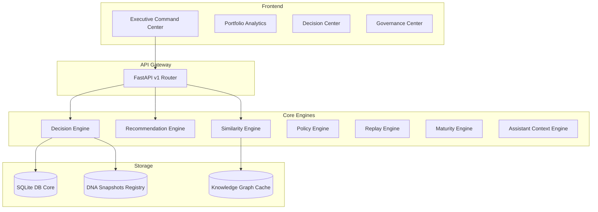

# YOWON AI — Enterprise Core Architecture Specification (v1.0)

This document specifies the frozen enterprise-grade core architecture of YOWON AI, which operates as an Enterprise Decision Operating System.

---

## 1. Unified Subsystem Architecture Map

---

## 2. Subsystems Registry & Classifications

### 2.1 Enterprise Identity & Authentication
- **Purpose**: Restrict access and secure operations using JWT-based protocols.
- **Responsibilities**: Manage users, passwords, sessions, and refresh tokens.
- **Dependencies**: Database, encryption utilities.
- **Extension Points**: Multi-factor authentication adapters, external OAuth providers.

### 2.2 Organizations & Workspace Isolation
- **Purpose**: Multi-tenant workspace data segregation.
- **Responsibilities**: Enforce that a query always scopes to the `workspace_id` header context.
- **Dependencies**: Database, request context middlewares.
- **Extension Points**: Cross-tenant data sharing policy overrides.

### 2.3 Repository Intelligence & Knowledge Graph
- **Purpose**: Evaluates files and imports to form semantic graphs.
- **Responsibilities**: Parse repositories, generate nodes/edges, compile complexity parameters.
- **Dependencies**: Background jobs, semantic parser modules.
- **Extension Points**: Support for new language parsers.

### 2.4 Project DNA Engine
- **Purpose**: Generates semantic fingerprints from code structures.
- **Responsibilities**: Extracting metrics and technology attributes into snapshots.
- **Dependencies**: Repository intelligence, extractors registry.
- **Extension Points**: Add new extraction plug-ins.

### 2.5 Decision Registry & Snapshot Store
- **Purpose**: Immutable registry tracking of evaluations.
- **Responsibilities**: Git-like commit pointers referencing frozen snapshots.
- **Dependencies**: Database models, Multi-Agent evaluations context.
- **Extension Points**: Extended metrics fields logging.

### 2.6 Governance & Policy Engine
- **Purpose**: Enforce compliance thresholds.
- **Responsibilities**: Stage checks, reviewer approvals, exceptions, and audit logs.
- **Dependencies**: Decision registry, database.
- **Extension Points**: Custom compliance workflow actions.

---

## 3. Core Architecture Immutability Guarantee

The components listed above represent the stable base of the system. Future feature additions (e.g. integrations with external source control providers, or federated agents) must utilize adapters or plugins, ensuring database and API level compatibility is maintained.
